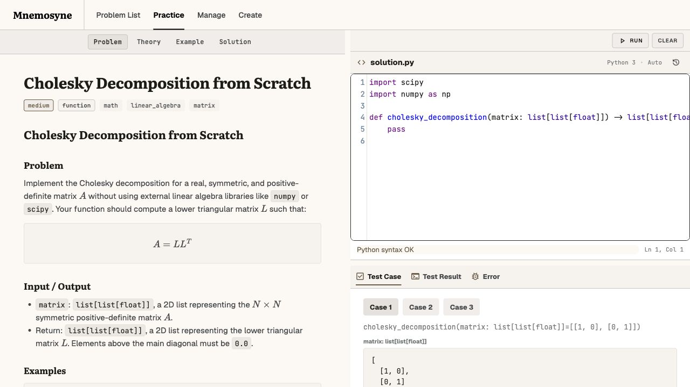
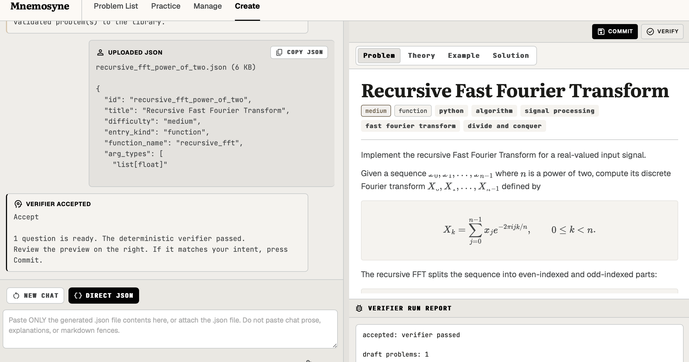

# Mnemosyne

Design Your Own Code Problem with Mnemosyne.

Mnemosyne helps you build a small personal problem bank. 
It is useful for you if you want to design your own code 
test for different subjects like leetcode style coding problem,
ML coding, numerical methods coding.


## Start
Design Your Own code test with python and markdown !

## Install


```bash
./scripts/setup.sh
./scripts/run.sh
```

Open:

```text
http://127.0.0.1:8000
```

Use another port:

```bash
./scripts/run.sh 8854
```

## Cross-Platform Start

Use the Python scripts on macOS, Linux, or Windows:

```bash
python scripts/setup.py
python scripts/run.py
```

Then open:

```text
http://127.0.0.1:8000
```

To use another port:

```bash
python scripts/run.py 8854
```

## Screens

### Practice

You can practice your coding and look at your solution here.



### Manage

You can modify the problem and create new problem here.


### Create

You can copy paste the prompt or chat with LLM to generate the .json file and import in the problem bank here. The LLM function is under development. I suggest you to create the problem through Manage.


## Dependencies

`setup.sh` creates `.venv` and installs:

```text
fastapi, uvicorn, pydantic, numpy, torch, jax[cpu], pandas, scipy
```

## Customize Virtual Environment and LLM Prompts

### Virtual environment

`./scripts/setup.sh` creates the local `.venv`. It looks for Python 3.10 through Python 3.13.

To choose a specific Python version:

```bash
PYTHON=python3.12 ./scripts/setup.sh
```

To add or remove packages for the web app, edit:

```text
requirements/base.txt
```

To add or remove optional ML packages for problem examples, edit:

```text
requirements/ml.txt
```

After changing requirement files, rebuild the virtual environment:

```bash
rm -rf .venv
./scripts/setup.sh
```

For a quick experiment, you can install one package directly:

```bash
.venv/bin/python -m pip install package-name
```

If a problem needs a package, also add it to the problem JSON file:

```text
content/problems/<problem_id>/problem.json
```

Use the problem's `requirements` field so Mnemosyne knows what that problem depends on.

### LLM prompts

Prompt files are stored here:

```text
mnemosyne/prompts/json/
```

Useful prompt files:

```text
direct_json_authoring_prompt.json   prompt copied to comunicate with your chatbot
```

## Files

```text
mnemosyne/          app code
content/problems/  problem JSON add your own problem from .json file.
requirements/      dependencies
scripts/           setup, run, checks
data/              local database, created when the app runs
```

## Check

```bash
.venv/bin/python -B scripts/checks/smoke_check.py
.venv/bin/python -B scripts/checks/stitch_ui_check.py
```

For a fuller local pass, run the other checks in `scripts/checks/` the same way.
