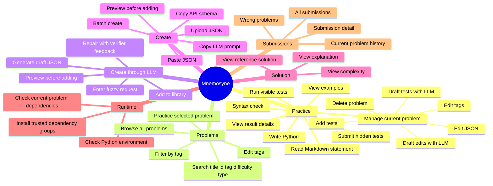
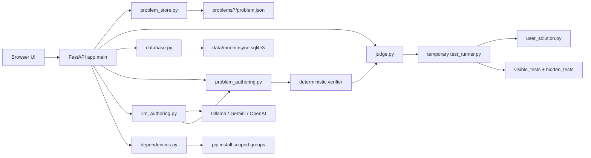
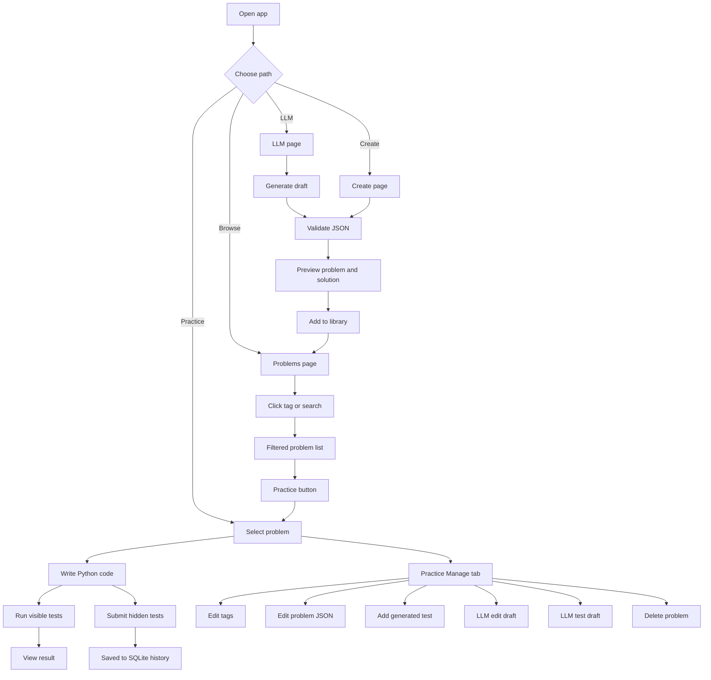
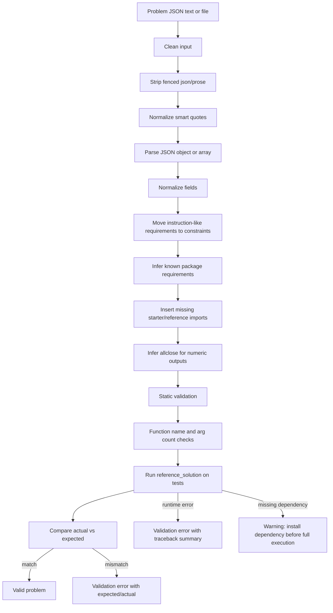
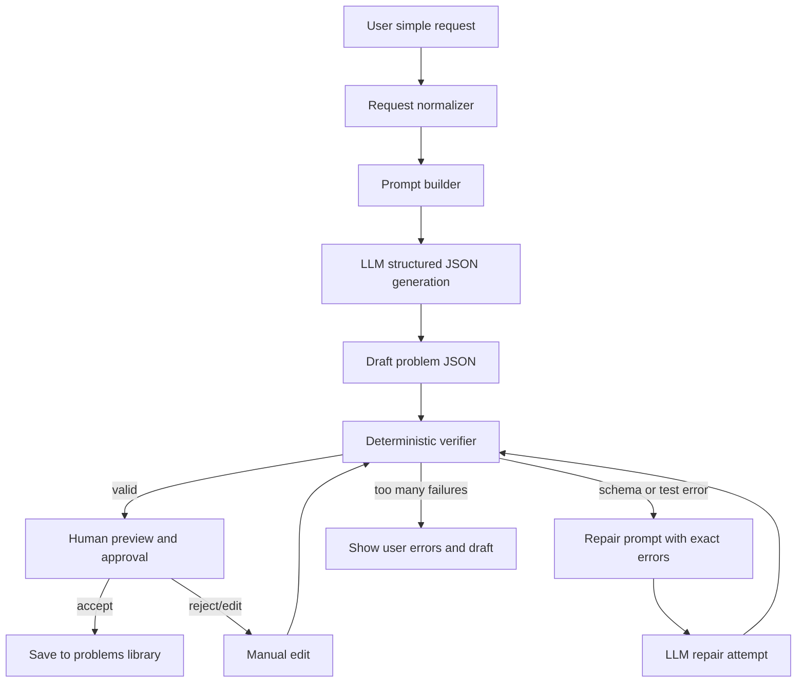
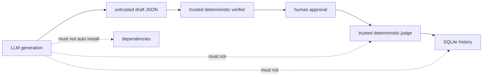

# Mnemosyne System Overview

This note is written for Obsidian. The diagrams use Mermaid.

## Product Status

The app is now stable enough for local personal use and for building a small Python problem bank. The core loop is working:

- Practice a problem.
- Run visible tests and submit hidden tests.
- Store submission history in SQLite.
- View wrong attempts and details.
- Create or edit problems from JSON.
- Generate or repair problem drafts through an optional LLM API.
- Validate problem JSON deterministically.
- Run the reference solution against expected outputs.
- Manage tags, tests, dependencies, and solutions.

It is not yet fully polished for a nontechnical user. The main remaining gaps are:

- Browser-level end-to-end tests are still missing.
- The authoring UX is better, but still technical.
- Generated problems need a review queue before they enter the library.
- The current LLM loop is synchronous and small; long batch generation will need progress state.
- Arbitrary user code is still safest for trusted local use unless Docker sandboxing is enabled.
- Dependency installs should remain explicit and scoped.

## 1. Feature Map



## 2. Current Architecture



## 3. User Flow



## 4. Deterministic Authoring Verifier



## 5. Request-To-Problem Generation



## 6. Current Generation Modules

```mermaid
flowchart LR
  UI[LLM and Manage UI] --> LlmAPI[/api/llm/*]
  LlmAPI --> LlmModule[app/llm_authoring.py]
  LlmModule --> Prompt[Prompt builders]
  LlmModule --> Client[OpenAIResponsesClient]
  LlmModule --> Repair[Small repair loop]
  LlmModule --> Tests[Test draft expected-output builder]

  Prompt --> Client
  Client --> RawJSON[raw model JSON]
  RawJSON --> ExistingVerifier[problem_authoring.validate_problem_collection]
  ExistingVerifier --> Repair
  Repair --> Client
  ExistingVerifier --> HumanReview[preview and approve]
  HumanReview --> ProblemFiles[problems/*/problem.json]
```

## 7. Suggested Boundary

Keep this boundary strict:



## Next Build Step

Before adding a larger agent, make the current request-to-draft path easier to audit:

1. Store generated drafts separately before they are accepted.
2. Show a diff when an LLM edits an existing problem.
3. Add browser-level tests for Create and Manage.
4. Add quality checks beyond correctness, such as duplicate tests and weak hidden cases.
5. Add progress state for larger batch generation.

This keeps the product simple while making generation useful.
